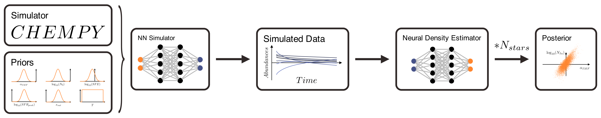
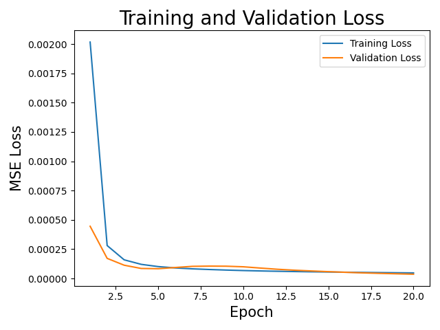
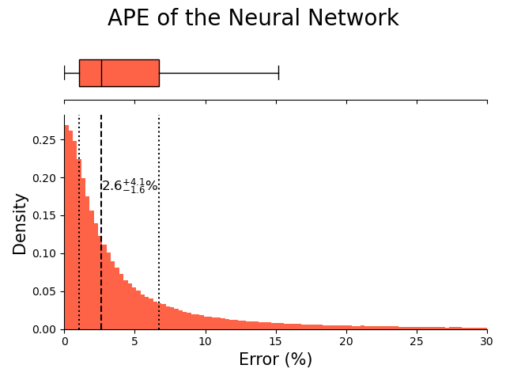
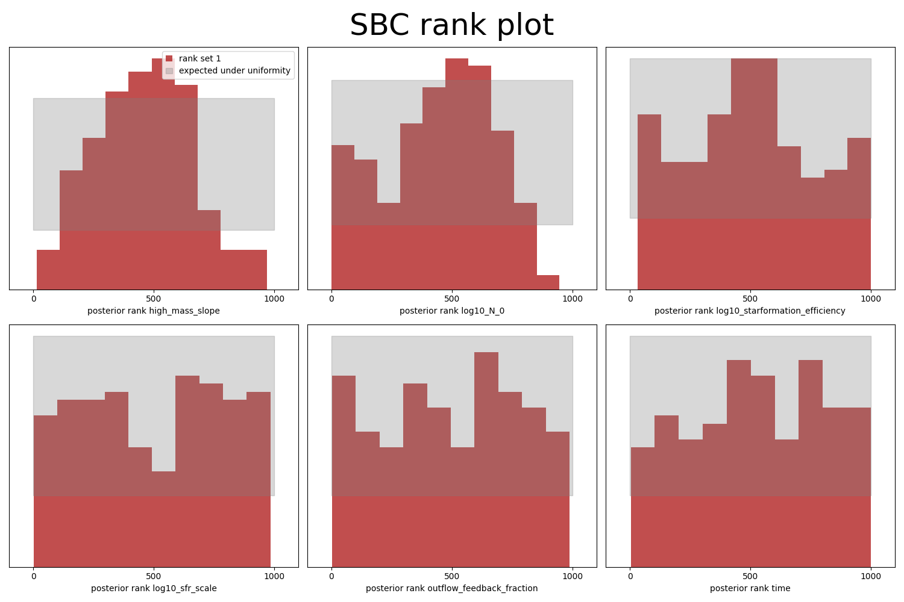
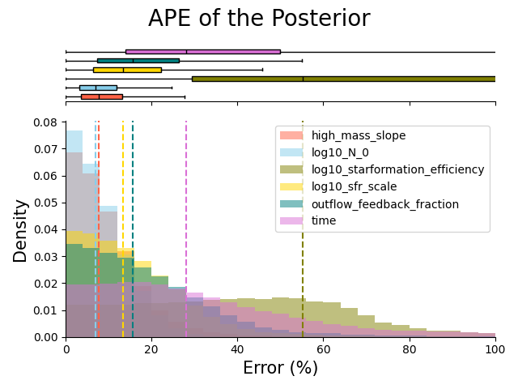

# Inferring Galactic Parameters from Chemical Abundances with Simulation-Based Inference
$CHEMPY$ is a chemical evolution code that simulates the chemical evolution of galaxies. <br>
We use $CHEMPY$ to simulate chemical abundances of stars in a galaxy. <br>
We then train a neural network (NN) to learn the mapping from galactic parameters to chemical abundances to replace $CHEMPY$ as simulator and create more training points for the Neural Posterior Estimator (NPE). <br>
Finally we use the NN to train a NPE to infer the galactic parameters from the chemical abundances.

Our goal is to infer the global galactic parameters (initial mass function high-mass slope $\alpha_{IMF}$ & frequency of type Ia supernovae $log_{10}N_{Ia}$) from the chemical abundances of stars in a galaxy. <br>

The data used to train the NN and NPE is created with $CHEMPY$ as simulator and the TNG yield set in [``` chempy_test_data.py ```](chempy_test_data.py). <br>

<p align="center">
  
</p>

## 1. Train NN
Firstly we train a neural network to learn the mapping from chemical abundances to galactic parameters. For this we use data created with $CHEMPY$ as simulator. <br>
The NN is trained on $\sim 500,000$ data points and validated on $\sim 50,000$ data points. The batch size is set to $64$ and the learning rate is set to $0.001$ and trained for $20$ epochs. <br>
The NN is a simple feed-forward neural network with $2$ hidden layers and $100$ neurons in the first and $40$ neurons in the second layer. <br>
That is sufficient for the accuracy of the generated data, since its absolute percantage error (APE) of $1.3^{+1.6}_{-0.7}\\%$ on the validation set is far below the error rate of real world data of $5\\%$. <br>
It took around $50s$ to train the NN on CPU. <br>

|||
:-------------------------:|:-------------------------:
  |  


## 2. Train SBI
Secondly we use the NN to train a Neural Posterior Estimator (NPE). <br>
The network is a masked autoregressive flow (MAF) with $10$ hidden features and $1$ transform. <br>
For that a total of $10^5$ datapoints simulated with the NN are used to train the NPE until it converges.
This takes approximatley $10$ minutes on multiple CPUs. <br>
The accuracy is afterwards tested with the $\sim 50,000$ validation data points from the original simulator $CHEMPY$. Each observation is sampled $1000$ times and the mean is compared to the ground truth. <br>
The NPE is has an absolute percantage error (APE) of $14.4_{-8.1}^{+16.6}\\%$ for a single prediction and around $7\\%$ for the global parameters $\Lambda$, which we are interested in.<br>
The accuracy for a single prediction of the parameters is not really high. That's why we use multiple stars from the same galaxy to infer the global galactic parameters $\alpha_{IMF}$ & $log_{10}N_{Ia}$, since they are the same for all stars in the same galaxy. <br>

<div style="display: flex; justify-content: space-between;">
  
  
</div>


## 3. Inference

Finally we sample from the posterior distribution to infer the global galactic parameters. <br>
For that we use the chemical abundances of $1000$ stars from the same galaxy (meaning they have the same galactic parameters $\Lambda$) and the local parameters $\Theta_i$ are sampled from the priors.
The galactic parameters were fixed to  $\alpha_{IMF} = -2.3$ and $log_{10}N_{Ia} = -2.89$. <br>
The first set is created with the NN trained on data created with the TNG yield set. <br>
The second set is created from $CHEMPY$ directly with an alternative yield set. <br>
The third set is data created with the TNG simulator. <br>

## 4. Multistar Posterior
We can compute the posterior for a single star from the samples from the NPE. <br>
Because of the central limit theorem, we can write the posterior for a single star as a multivariate Gaussian. <br>
This gives us the mean and covariance of $\alpha_{IMF}$ and $log{N_{Ia}}$ for one observation. <br>

We can then combine the posterior for multiple stars to get the posterior for the entire dataset. 

$$ 
\begin{align*}
P(\theta| data) &\propto \prod_{i=1}^{N_{stars}} P(\theta| obs_i) \\ \\
&\propto \prod_{i=1}^{N_{stars}} \exp\left(-\frac{1}{2} \frac{(\theta-\mu_i)^2}{\sigma_i^2}\right)
\end{align*} 
$$

This is a product of Gaussians, so the posterior for the entire dataset is also a Gaussian with mean $\mathbf{\mu}$ and variance $\mathbf{\sigma}$. 

$$
\begin{align*}
\mathbf{\mu} &= \frac{\sum_{i=1}^{N_{stars}} \frac{\mu_i}{\sigma_i^2}}{\sum_{i=1}^{N_{stars}} \frac1{\sigma_i^2}} \\ \\
\mathbf{\sigma}^2 &= \frac1 {\sum_{i=1}^{N_{stars}} \frac1{\sigma_i^2}}
\end{align*}
$$

### $CHEMPY$ TNG yield set
<p align="center">
  
</p>

### $CHEMPY$ Alternative yield set
<p align="center">
  
</p>

### TNG simulation data
<p align="center">
  
</p>

| | $CHEMPY$ TNG yield set | $CHEMPY$ Alternative yield set | TNG simulation data |
---|---|---|---
||  |   | 
| SN Ia | TNG_net | Thielemann et al. (2003) |
| SN II | TNG_net | Nomoto et al. (2013) |
| AGB | TNG | Karakas & Lugaro (2016) |
| $\alpha_{IMF}$ | $-2.294 \pm 0.009$ | $-2.273 \pm 0.009$ | $-2.311 \pm 0.009$ |
|$\log_{10}N_{Ia}$| $-2.894 \pm 0.010$ | $-2.929 \pm 0.010$ | $-2.939 \pm 0.010$ |
| $\Delta\alpha_{IMF}$ | $0.3\\% $ | $1.1\\%$ | $0.5\\%$ |
| $\Delta\log_{10}N_{Ia}$ | $0.1\\%$ | $1.3\\%$ | $1.7\\%$ |

As expected, the inferred parameters deviate from the ground truth for a sigle prediction, since the NPE has a high error rate, 
but is able to infer the global parameters with a high accuracy for a growing number of stars in the case where we used data created with the correct yield set
that the posterior was trained on. 
The prediction for the TNG simulator seems also to be quite close to the ground truth. <br>
The deviation is higher for the alternative yield set, since the NN was trained on the TNG yield set and the NPE is not able to generalize to other yield sets. <br>
The total inference time for $1000$ simulations for the $1000$ stars is around $10$ seconds for each yield set and therefore orders of magnitudes faster then traditional MCMC methods, which would take around $40$ hours for $200$ stars. <br>
The total time from training the NN emulator to the final inference is less than half an hour. <br>
