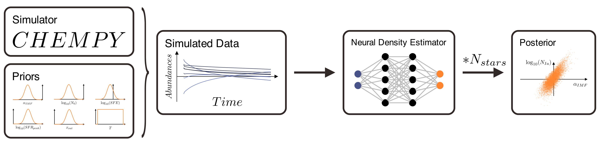

# Inferring Galactic Parameters from Chemical Abundances with Simulation-Based Inference

## 1. Train NN
Firstly we train a neural network to learn the mapping from chemical abundances to galactic parameters. For this we use data created with CHEMPY as simulator.  
The NN is trained on xx data points and validated on xx data points.  
The batch size is set to 64 and the learning rate is set to 0.001 and trained for 20 epochs.  
The NN is a simple feedforward neural network with 2 hidden layers and 100 neurons in the first and 40 neurons in the second layer.  

  
  

## 2. Train SBI
Secondly we use the trained neural network to train a simulator-based inference algorithm. We use the Sequential Neural Posterior Estimation (SNPE) algorithm.  
For that a total of 1 million simulations are used to train the algorithm.

## 3. Sample from Posterior
Finally we sample from the posterior distribution to infer the galactic parameters.

## 4. Plot Results