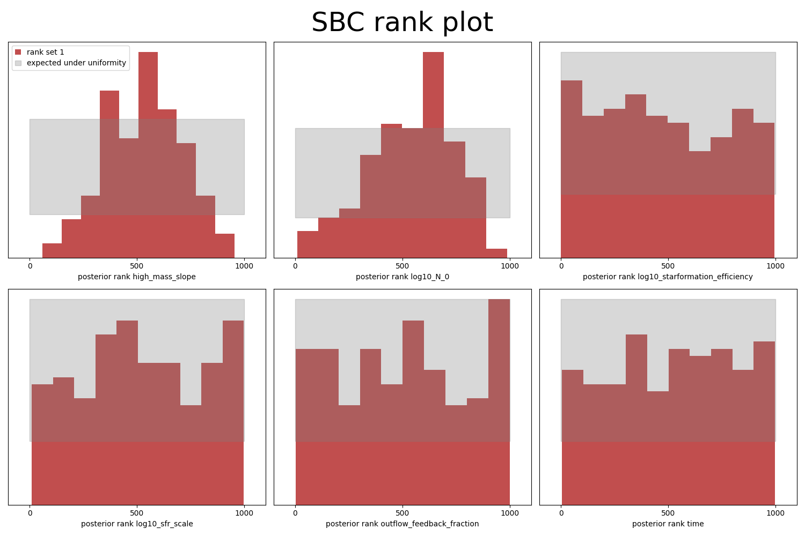
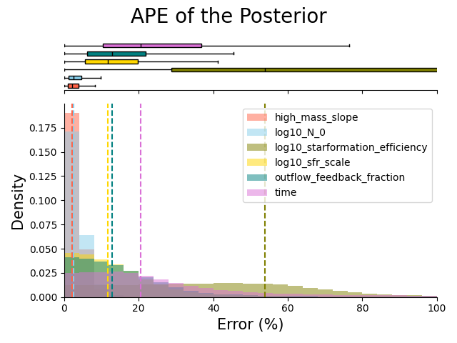
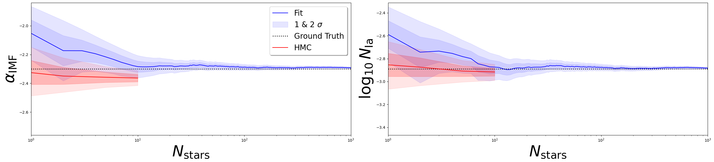
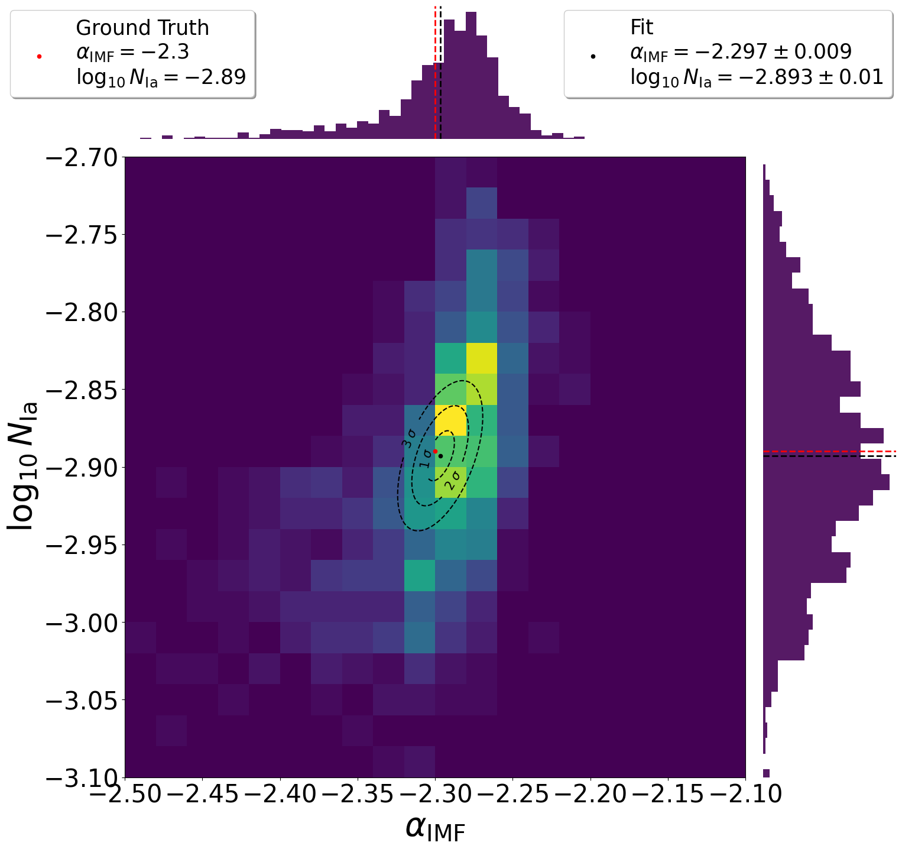
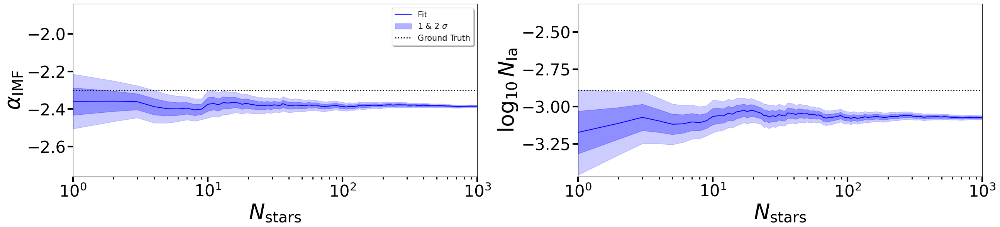
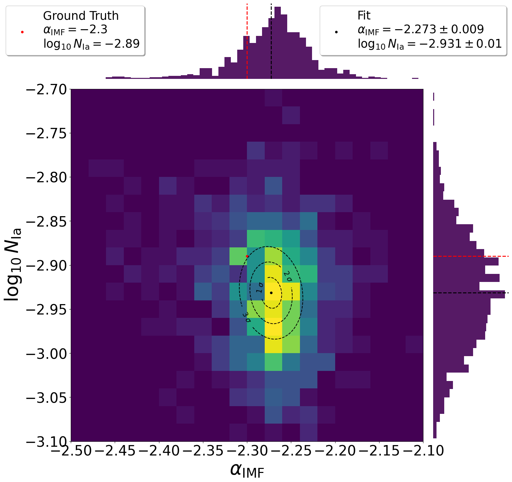
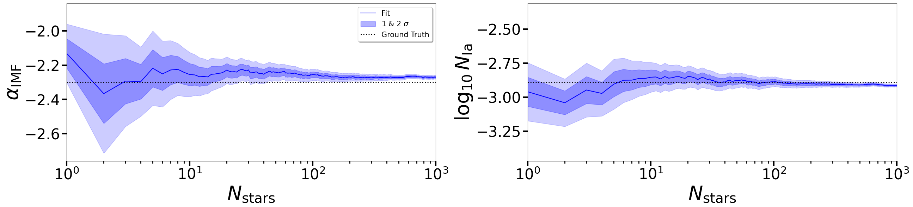
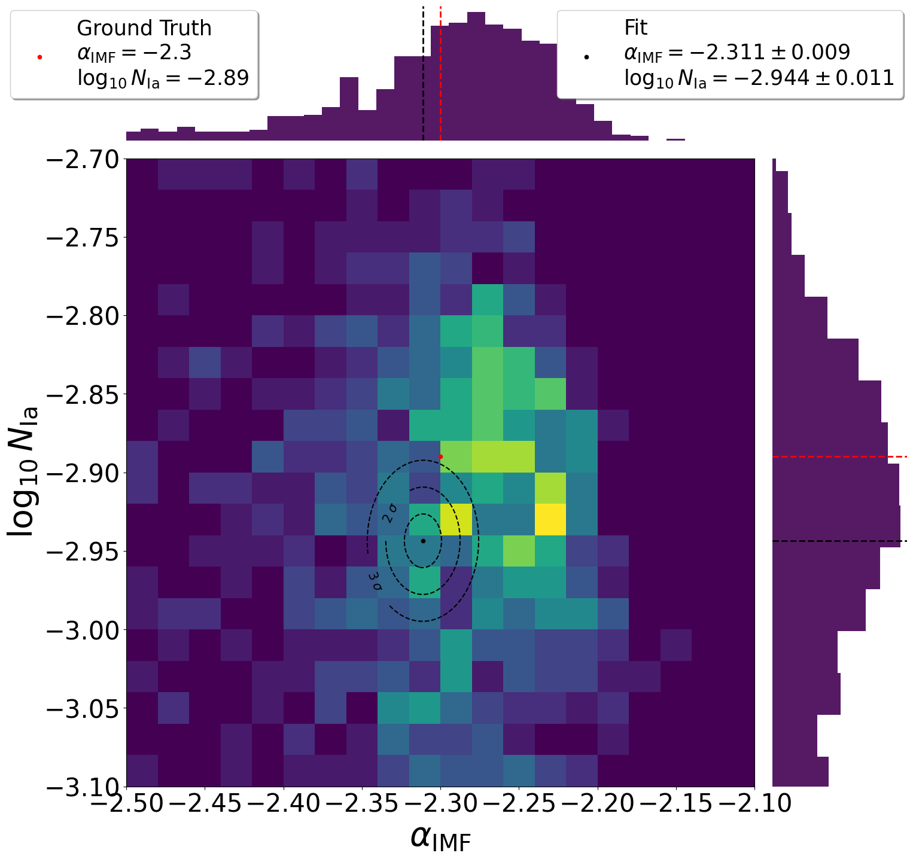

# Inferring Galactic Parameters from Chemical Abundances with Simulation-Based Inference
$CHEMPY$ is a chemical evolution code that simulates the chemical evolution of galaxies. <br>
We use $CHEMPY$ to simulate chemical abundances of stars in a galaxy. <br>
We then train a neural network (NN) to learn the mapping from galactic parameters to chemical abundances to replace $CHEMPY$ as simulator and create more training points for the Neural Posterior Estimator (NPE). <br>
Finally we use the NN to train a NPE to infer the galactic parameters from the chemical abundances.

Our goal is to infer the global galactic parameters (initial mass function high-mass slope $\alpha_{IMF}$ & frequency of type Ia supernovae $log_{10}N_{Ia}$) from the chemical abundances of stars in a galaxy. <br>

The data used to train the NN and NPE is created with $CHEMPY$ as simulator and the TNG yield set in [``` chempy_test_data.py ```](chempy_test_data.py). <br>

<p align="center">
  
</p>

## 1. Train NN
Firstly we train a neural network to learn the mapping from chemical abundances to galactic parameters. For this we use data created with $CHEMPY$ as simulator. <br>
The NN is trained on $\sim 500,000$ data points and validated on $\sim 50,000$ data points. The batch size is set to $64$ and the learning rate is set to $0.001$ and trained for $20$ epochs. <br>
The NN is a simple feed-forward neural network with $2$ hidden layers and $100$ neurons in the first and $40$ neurons in the second layer. <br>
That is sufficient for the accuracy of the generated data, since its absolute percantage error (APE) of $1.6^{+2.4}_{-0.9}\%$ on the validation set is far below the error rate of real world data of $5\%$. <br>
It took around $50s$ to train the NN on CPU. <br>

<div style="display: flex; justify-content: space-between;">
  
  
</div>

## 2. Train SBI
Secondly we use the NN to train a Neural Posterior Estimator (NPE). <br>
For that a total of $10^5$ datapoints simulated with the NN are used to train the NPE until it converges.
This takes approximatley $11$ minutes on CPU. <br>
The accuracy is afterwards tested with the $\sim 50,000$ validation data points from the original simulator $CHEMPY$. Each observation is sampled $1000$ times and the mean is compared to the ground truth. <br>
The NPE is has an absolute percantage error (APE) of $9.1^{+16.6}_{-6.2}\%$ for a single prediction. <br>

<div style="display: flex; justify-content: space-between;">
  
  
</div>

The accuracy for a single prediction of the parameters is not really high. That's why we use multiple stars from the same galaxy to infer the global galactic parameters $\alpha_{IMF}$ & $log_{10}N_{Ia}$, since they are the same for all stars in the same galaxy. <br>

## 3. Sample from Posterior
Finally we sample from the posterior distribution to infer the global galactic parameters. <br>
For that we use the chemical abundances of $1000$ stars from the same galaxy created with the NN. We used $\alpha_{IMF} = -2.3$ and $log_{10}N_{Ia} = -2.89$ and draw the local parameters from the prior distributions. <br>
The NPE is then used to infer the global galactic parameters. <br>
As expected, the inferred parameters deviate from the ground truth, since the NPE has a high error rate for a single prediction, but is able to infer the global parameters with a high accuracy for a growing number of stars. <br>
The total inference time for the $1000$ stars is around $1$ minute.

<div style="display: flex; justify-content: space-between;">
  
  
</div>

We can see that the estimated parameters $\alpha_{IMF}$ & $log_{10}N_{Ia}$ can be predicted with a high accuracy in a reasonable time compared to traditional MCMC methods. <br>

### CHEMPY alternative yield set
The posterior trained above was also tested with data created with an alternative yield set in the $CHEMPY$ simulator.
| Type | Yield Table |
| --- | --- |
| SN Ia | Thielemann et al. (2003) |
| SN II | Nomoto et al. (2013) |
| AGB | Karakas & Lugaro (2016) |

We can see, that the predicted values are off from the ground truth. This is due to the fact that the NN was trained on the TNG yield set and the NPE is not able to generalize to other yield sets. <br>
However, the deviation is not that high with an error of $\Delta\alpha_{IMF}=3.7\%$ and $\Delta log_{10}N_{Ia}=6.3\%$.

<div style="display: flex; justify-content: space-between;">
  
  
</div>

### TNG simulation data
We also tested the posterior trained above with data created with the TNG simulator.
The prediction is still a bit off from the ground truth, even though the NN was trained on $CHEMPY$ data created with the TNG yield set. <br>
However, the errors are still in an acceptable range with $\Delta\alpha_{IMF}=1.3\%$ and $\Delta log_{10}N_{Ia}=0.8\%$.
<div style="display: flex; justify-content: space-between;">
  
  
</div>