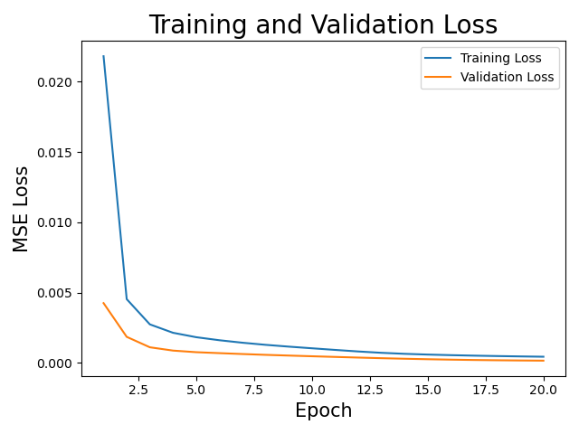

# Inferring Galactic Parameters from Chemical Abundances with Simulation-Based Inference
$CHEMPY$ is a chemical evolution code that simulates the chemical evolution of galaxies.  
We use $CHEMPY$ to simulate chemical abundances of stars in a galaxy.  
We then train a neural network (NN) to learn the mapping from galactic parameters to chemical abundances to replace $CHEMPY$ as simulator and create more training points for the Neural Posterior Estimator (NPE).  
Finally we use the NN to train a NPE to infer the galactic parameters from the chemical abundances.

Our goal is to infer the global galactic parameters (initial mass function high-mass slope $\alpha_{IMF}$ & frequency of type Ia supernovae $log_{10}N_{Ia}$) from the chemical abundances of stars in a galaxy.  

## 1. Train NN
Firstly we train a neural network to learn the mapping from chemical abundances to galactic parameters. For this we use data created with $CHEMPY$ as simulator.  
The NN is trained on $\sim 500,000$ data points and validated on $\sim 50,000$ data points. The batch size is set to $64$ and the learning rate is set to $0.001$ and trained for $20$ epochs.  
The NN is a simple feedforward neural network with $2$ hidden layers and $100$ neurons in the first and $40$ neurons in the second layer.  
That is sufficient for the accuracy of the generated data, since its error rate of $0.006^{+0.006}_{-0.004}$ dex is far below the error rate of real world data of $0.05$ dex.  
It took around $50s$ to train the NN on CPU.  

  
  

## 2. Train SBI
Secondly we use the NN to train a Neural Posterior Estimator (NPE).  
For that a total of 1 million datapoints simulated with the NN are used to train the NPE until it converges.
This takes approximatley $3$ h on CPU.  
The accuracy is afterwards tested with the $\sim 50,000$ validation data points from the original simulator $CHEMPY$.  
The NPE is has an absolute percantage error (APE) of $13.7^{+22.1}_{-10.6}\%$ for a single prediction.  

## 3. Sample from Posterior
Finally we sample from the posterior distribution to infer the galactic parameters.

## 4. Plot Results